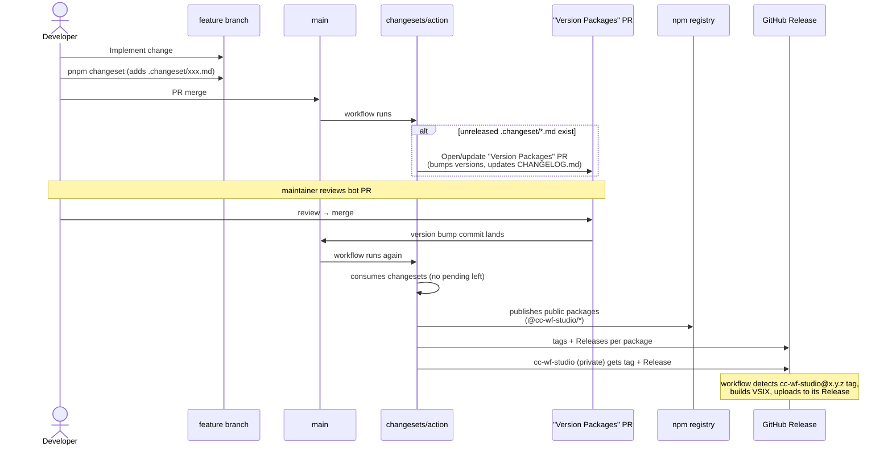
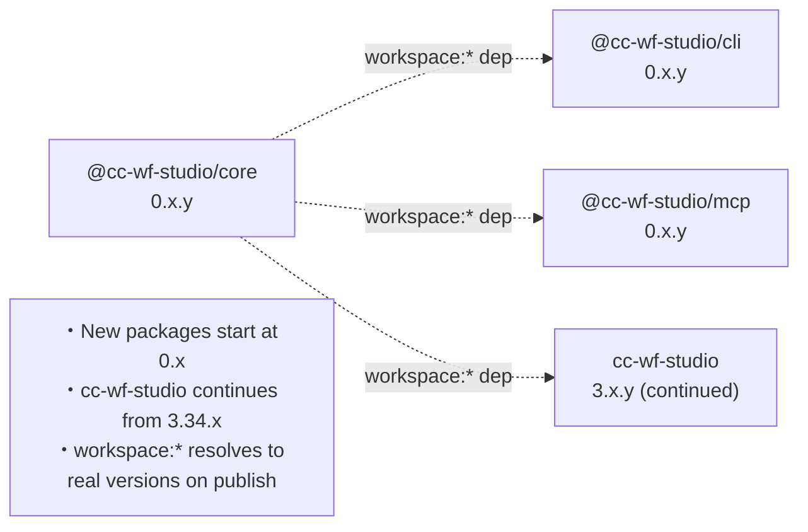
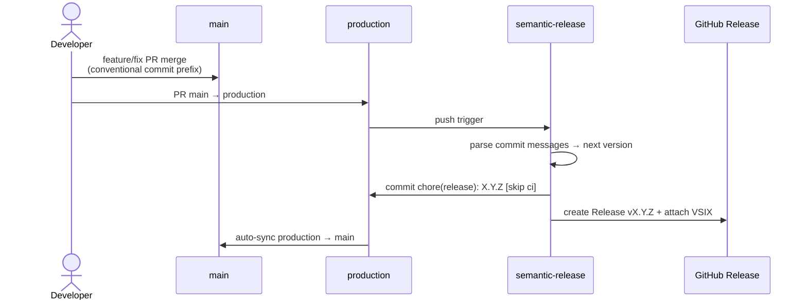

# Release Flow

This repository uses **[Changesets](https://github.com/changesets/changesets)** to manage versioning and publishing across the pnpm workspace. There is a **single release branch (`main`)** — all releases originate from PRs merged into `main`.

## TL;DR for contributors

1. Open a feature/fix PR against `main`.
2. If your change affects a published package, run `pnpm changeset` locally and commit the generated `.changeset/<name>.md` file.
3. Merge your PR. A bot will open or update a `chore(release): version packages` PR collecting all pending changesets.
4. Merging that bot PR cuts the actual release: tags, npm publish for `@cc-wf-studio/*`, and a GitHub Release with the VSIX attached for `cc-wf-studio`.

## Branch model

- `main` is the only long-lived release branch. Feature work branches off `main` and merges back via PR.
- There is no `production` branch. (Removed in the monorepo restructure.)

## What each package looks like at release

| Package | npm | GitHub Release tag | VSIX attached |
|---|---|---|---|
| `@cc-wf-studio/core` | ✅ public | `@cc-wf-studio/core@x.y.z` | — |
| `@cc-wf-studio/cli` | ✅ public | `@cc-wf-studio/cli@x.y.z` | — |
| `@cc-wf-studio/mcp` | ✅ public | `@cc-wf-studio/mcp@x.y.z` | — |
| `cc-wf-studio` (VSCode extension) | ❌ private | `cc-wf-studio@x.y.z` | ✅ `cc-wf-studio-x.y.z.vsix` |

`cc-wf-studio` is marked `"private": true` so Changesets versions and tags it but does not push it to npm. The VSIX is built and uploaded to the corresponding GitHub Release by the workflow.

> **Marketplace / Open VSX** auto-publish is **not** wired up in this Phase 1 setup. Publishing the VSIX to the VSCode Marketplace and Open VSX is currently a manual step performed by a maintainer after the VSIX has been generated.

## End-to-end flow



## Independent versions

Each workspace package is versioned independently — there is no `fixed` or `linked` group in `.changeset/config.json`. The intent:



Notes:

- `cc-wf-studio` keeps its existing 3.34.x version stream so the Marketplace listing remains continuous.
- New packages start at low pre-1.0 versions until their APIs settle (the [Changesets docs](https://github.com/changesets/changesets/blob/main/docs/decisions.md) cover when to graduate).
- `workspace:*` dependencies between local packages are replaced with the actual published versions when `changeset publish` runs.

## Required secrets

The release workflow requires these repository secrets:

| Secret | Purpose |
|---|---|
| `RELEASE_BOT_APP_ID` | GitHub App ID used to author release commits/PRs as a bot (so subsequent workflows can be triggered). |
| `RELEASE_BOT_PRIVATE_KEY` | Private key for the above GitHub App. |
| `NPM_TOKEN` | Token for publishing `@cc-wf-studio/*` to npm. **Required even though Phase 1 ships only skeletons** — Changesets will silently skip the publish step if all bumped packages are private, but the token is still validated when `changeset publish` runs. |

## Authoring a changeset

```bash
pnpm changeset
```

The interactive prompt asks:

1. Which packages changed? (Use space to select.)
2. What bump level? (`patch` / `minor` / `major`).
3. A summary used for the changelog entry.

Commit the generated file alongside your code change. CI will pick it up on merge.

## What doesn't trigger a release

- Pushes to branches other than `main`.
- Merges that contain no `.changeset/*.md` (no version bump → no PR opened).
- Pure docs / chore PRs where you intentionally omit a changeset.

## Previous release flow (for reference)

Before the monorepo restructure, releases were driven by **`semantic-release`** on push to a separate `production` branch:



Both the `production` branch and `semantic-release` are removed; the equivalent capability is now provided by Changesets on `main`.
